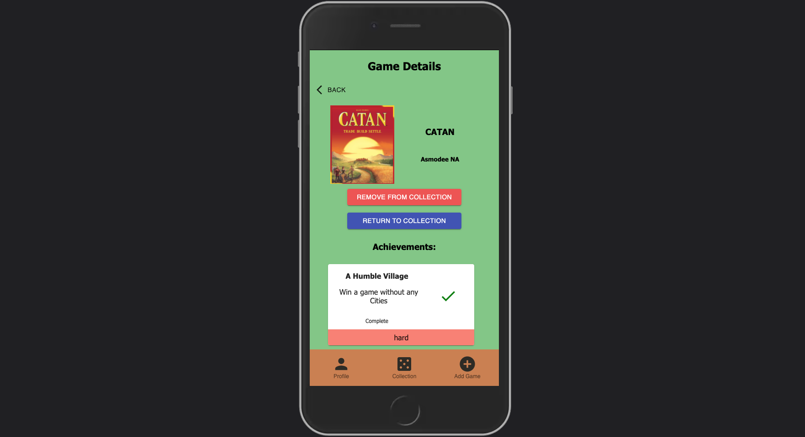

# Board Game Achievement Tracker

## About
Board Game Achievement Tracker is a Full Stack React Application. This application allows users to add boardgames to their virtual collection and record achievements they complete. 


### Screen Shot



# Running the Application

## System Requirements

Make sure you have the following software installed on your computer or server:

- [Node.js](https://nodejs.org/en/)
- [PostrgeSQL](https://www.postgresql.org/)
- [Nodemon](https://nodemon.io/)

## Create database and table

Create a new database called `boardgame_achievement_tracker`

Run the queries in the database.sql file to create the database tables and populate with sample data.

## Development Setup Instructions

- Run `npm install`
- Create a `.env` file at the root of the project and paste this line into the file:
  ```
  SERVER_SESSION_SECRET=superDuperSecret
  ```
  While you're in your new `.env` file, take the time to replace `superDuperSecret` with some long random string like `25POUbVtx6RKVNWszd9ERB9Bb6` to keep your application secure. Here's a site that can help you: [https://passwordsgenerator.net/](https://passwordsgenerator.net/). If you don't do this step, create a secret with less than eight characters, or leave it as `superDuperSecret`, you will get a warning.
- Start postgres if not running already by using `brew services start postgresql`
- Run `npm run server`
- Run `npm run client`
- Navigate to `localhost:3000`

